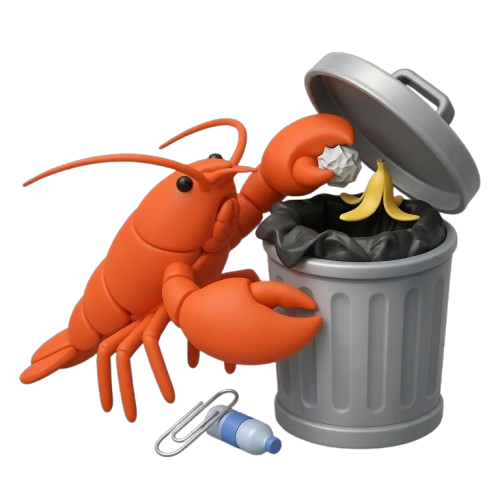

<p align="center">
  
</p>

<h1 align="center">openclaw-gc</h1>

<p align="center">
  Garbage collector and guardrails for <a href="https://openclaw.ai">OpenClaw</a> AI agents.<br/>
  Stop agents from trashing your filesystem.
</p>

---

## The Problem

OpenClaw agents are powerful, but they make a mess:

- **Create files and folders everywhere** — random temp files, orphaned directories, duplicated configs
- **Modify critical dotfiles** — agents have been caught editing `~/.zshrc`, `~/.ssh/`, `~/.aws/credentials`
- **Run destructive commands** — `rm -rf`, `chmod 777`, piping curl to bash
- **Leave residuals after sessions** — services running, config files scattered, no cleanup

**openclaw-gc** runs alongside OpenClaw as a safety layer — tracking what agents do, blocking dangerous actions, and cleaning up after them.

## How It Works

Three layers of protection:

```
┌─────────────────────────────────────────────┐
│  Guardrails (pre-execution)                 │
│  Block dangerous paths, commands, rate limit │
├─────────────────────────────────────────────┤
│  Monitor (runtime)                          │
│  Track every file create/modify/delete       │
├─────────────────────────────────────────────┤
│  Collector (post-execution)                  │
│  Scan orphans, rollback sessions, sweep      │
└─────────────────────────────────────────────┘
```

## Install

```bash
npm install -g @openclaw/gc
```

## CLI Usage

```bash
# Check GC status and stats
ocgc status

# Scan for orphaned files agents left behind
ocgc scan

# Preview what would be cleaned (safe)
ocgc clean --dry-run

# Actually clean up
ocgc clean

# List agent sessions
ocgc sessions list

# See everything a session did
ocgc sessions inspect <session-id>

# Undo all changes from a session
ocgc rollback <session-id>
ocgc rollback <session-id> --dry-run

# Start the API server (for dashboard/UI)
ocgc serve

# Manage configuration
ocgc config show
ocgc config allow ~/my-project
ocgc config protect ~/.env.local
ocgc config set maxFilesPerMinute 50
ocgc config set dryRun true
```

## OpenClaw Plugin

Install as a plugin to get real-time guardrails inside OpenClaw:

```bash
# Copy to OpenClaw plugins directory
cp -r node_modules/@openclaw/gc/dist/plugin ~/.openclaw/plugins/openclaw-gc
```

Once installed, the plugin hooks into `before_tool_call` and automatically:

- Blocks file writes outside allowed directories
- Blocks destructive shell commands (`rm -rf`, `chmod 777`, `curl | bash`, etc.)
- Rate limits file operations (default: 30/min)
- Logs all blocked actions for review

## Configuration

Config lives at `~/.openclaw-gc/config.json`:

```json
{
  "allowedPaths": ["~/Documents", "~/Code", "~/Projects", "/tmp"],
  "protectedPaths": ["~/.ssh", "~/.aws", "~/.zshrc", "~/.gitconfig", "~/.env"],
  "maxFilesPerMinute": 30,
  "maxDirDepth": 10,
  "autoCleanPatterns": ["**/.tmp-*", "**/tmp-openclaw-*"],
  "journalRetentionDays": 30,
  "dryRun": false,
  "apiPort": 18790
}
```

| Key | Default | Description |
|-----|---------|-------------|
| `allowedPaths` | Common user dirs | Directories agents can write to |
| `protectedPaths` | Dotfiles, SSH, AWS | Paths that are never writable |
| `maxFilesPerMinute` | `30` | Rate limit per session |
| `maxDirDepth` | `10` | Max directory nesting depth |
| `autoCleanPatterns` | Temp/cache patterns | Globs for automatic cleanup |
| `dryRun` | `false` | Global dry-run mode |
| `apiPort` | `18790` | REST API port |

## API

Start the API server with `ocgc serve` for dashboard/UI integration:

```
GET  /health           → Health check
GET  /stats            → GC statistics
GET  /sessions         → List sessions
GET  /sessions/:id     → Session details
GET  /sessions/:id/events → Session filesystem events
POST /sessions/:id/rollback → Rollback a session
GET  /gc/scan          → Scan for orphans
POST /gc/run           → Execute cleanup
GET  /blocked          → Blocked actions log
GET  /gc/history       → GC run history
```

All endpoints return JSON — plug in any frontend.

## Architecture

```
src/
├── core/           # Business logic (reusable by CLI, API, plugin)
│   ├── config.ts       # Config management
│   ├── db.ts           # SQLite journal
│   ├── guardrails.ts   # Path checks, command checks, rate limiting
│   ├── monitor.ts      # Filesystem watcher (chokidar)
│   ├── journal.ts      # Session tracking
│   └── collector.ts    # GC: scan, cleanup, rollback
├── api/            # REST API (Fastify)
├── cli/            # CLI commands (Commander)
├── plugin/         # OpenClaw plugin (hooks)
└── index.ts        # Public library exports
```

Core logic is decoupled from interfaces — the same engine powers the CLI, the API, and the OpenClaw plugin.

## Development

```bash
git clone https://github.com/lucianfialho/openclaw-gc.git
cd openclaw-gc
npm install
npm run build
npm test
```

## License

MIT
